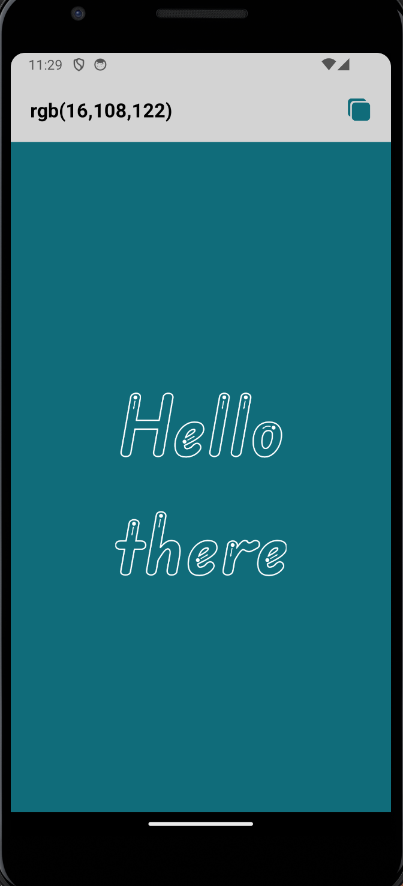
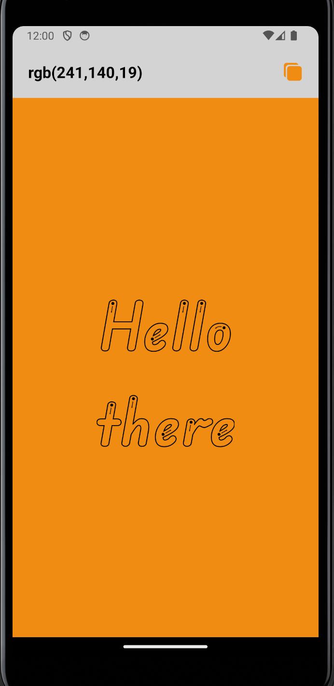
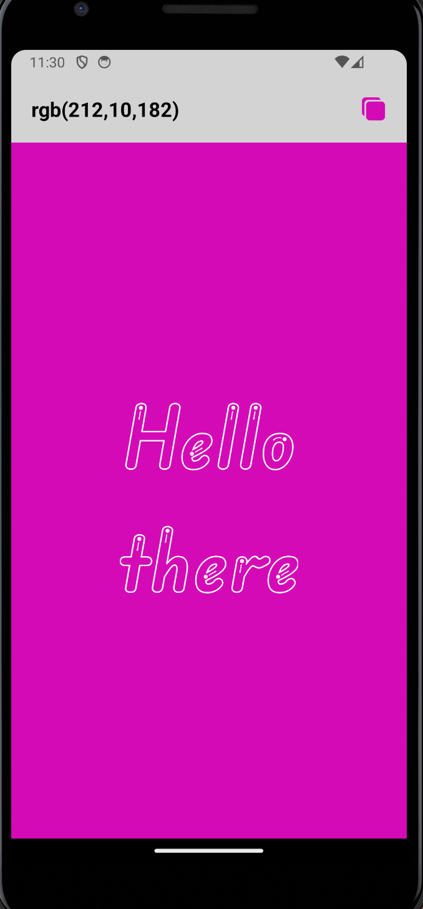

# Test Task - React Native App

## Features

- **Dynamic Color Change:** Tap anywhere on the screen to generate a random background color.
- **Smooth Animation:** Background color transitions are smoothly animated for an enhanced user experience.
- **Color Name Display:** The current color's RGB code is displayed at the top of the screen.
- **Copy Button:** A button next to the color name lets users copy the RGB value to the clipboard. After copying, a brief visual confirmation (green checkmark) is displayed.
- **Custom Fonts:** The app uses custom fonts to stylize the text.

### App Screens

    
    
    

